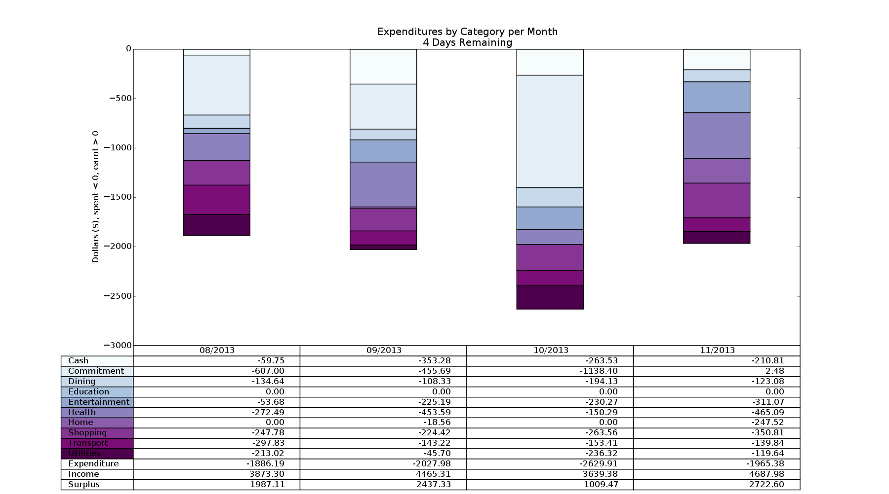
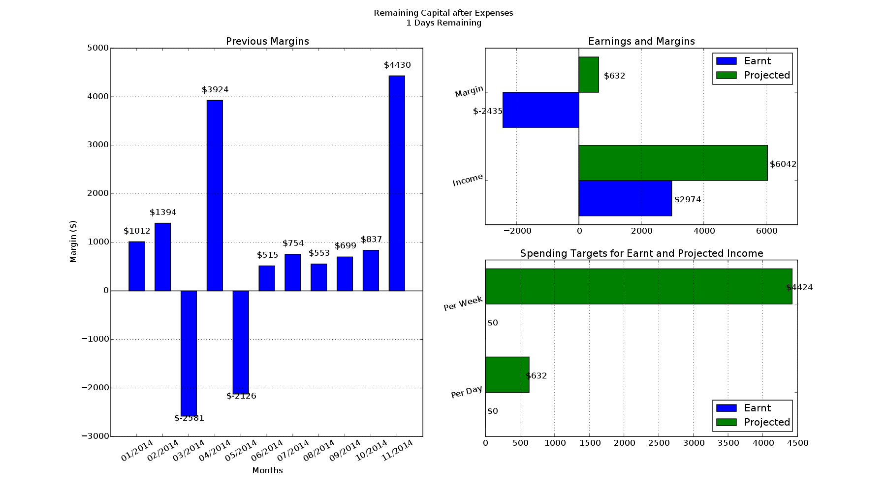
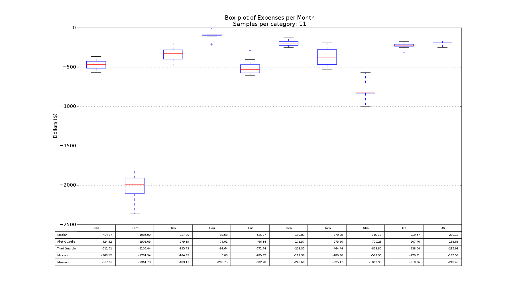
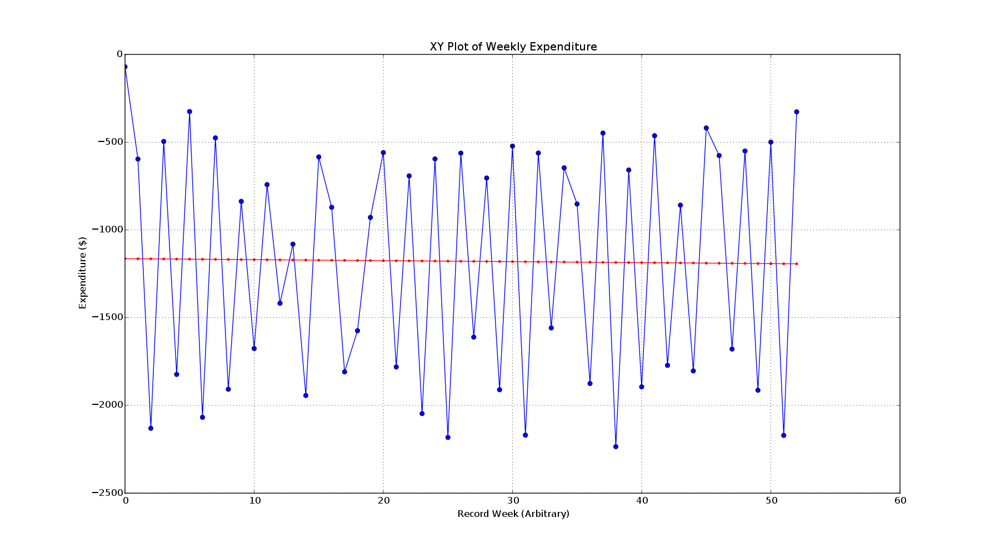
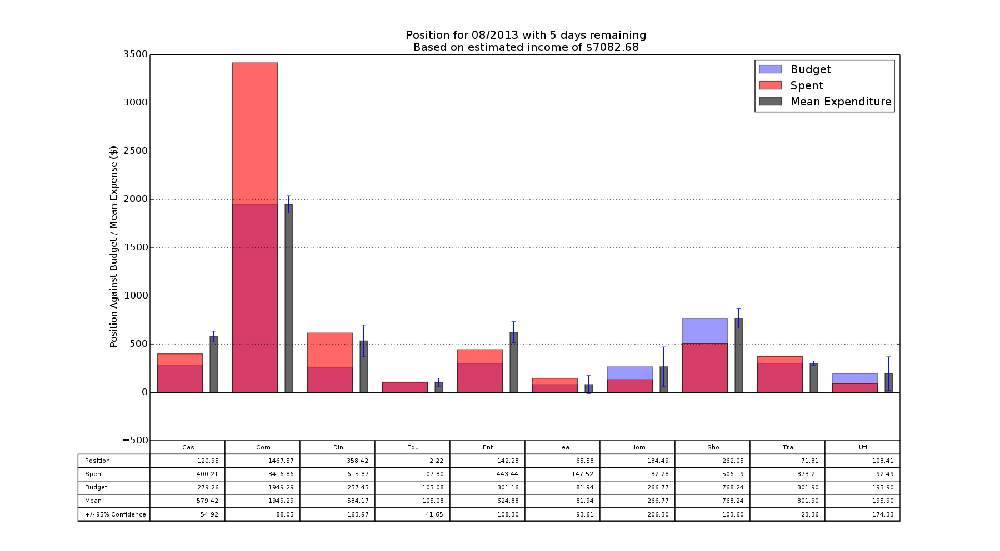
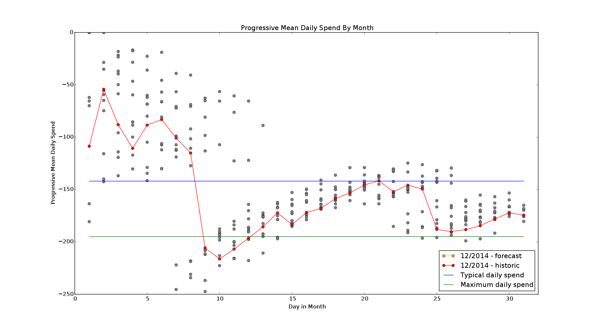
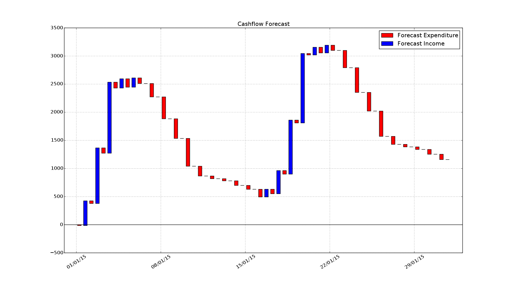

Overview
========

Accumulate and analyse your CSV transaction data to visualise your income and
expenditure.  The categories are based on those used by the Australian Tax
Office on their [MoneySmart website](https://www.moneysmart.gov.au/). These
scripts were hacked together out of laziness when the author got fed up with
manually entering his data into the site.

Example Output
========

Details
=======

Transactions are put in one of the following categories:

* Cash - Withdrawals from ATMs, given its own category as it's hard to track
* Commitment - Rent, mortgages, car repayments, etc
* Dining - Cafes, Restaurants, anything that's not a product of Shopping
* Education - School fees, textbooks
* Entertainment - Anything you shouldn't be doing if tight for money
* Health - Private health, gap payments, pet psychology
* Home - Furniture, repairs, gardening supplies
* Income - Any positive amounts
* Internal - Transfers between multiple accounts
* Shopping - Food, alcohol
* Transport - Car registration, insurance, fuel, bus fares, etc
* Utilities - Electricity, gas, phone, internet, etc

fpos is intended to track transaction data over long periods of time; that is,
it's expected that users will want to gradually add transactions to a central
database over time. fpos includes the tools for merging and deduplicating
transactions automatically, and learns from your previous interactions with it
to ease the burden of categorising your expenses.

fpos is currently a commandline tool, and so is not for the faint-of-heart. Out
of a want for simplicity (again, read as laziness), fpos uses a simple text
file as a database for the information it graphs. Power users might be
interested in tracking changes to their transaction database using [git](http://git-scm.com/) or
similar tools.

Somewhat similar to `git`, `fpos` has been split into porcelain and plumbing
commands.

The porcelain commands are:

* `fpos init`: Creates and configures a database
* `fpos update`: Handles the merge and annotation of bank export CSV files into the database
* `fpos show`: Displays collated transactions as graphs and tables

The plumbing commands are:

* `fpos transform`: Converts each bank's CSV export document into an intermediate
  representation (IR) suitable for further processing
* `fpos combine`: Merges multiple IR documents into one time-ordered document
* `fpos annotate`: Annotates an IR document with transaction types.
* `fpos visualise`: Displays collated transactions as graphs and tables
* `fpos window`: Output document transactions between given dates

The plumbing commands will remain unexplained for the moment.

Usage
=====

Covering just the porcelain commands, `fpos` can be driven as outlined below.
`fpos` currently supports CSV exports from the following banks:

* ANZ
* Commonwealth Bank
* St George
* NAB
* Bankwest

Create a Database
-----------------

    $ fpos init mydb ~/mydb.csv

This registers the nickname 'mydb' with `fpos` and points it to the CSV file in
which to record annotated transactions. `fpos init` only need be executed once
per database - from there on the nickname can be used with the `update` and
`show` subcommands.

Add Transactions
----------------

    $ fpos update mydb Transactions.csv ANZ.csv

Note that the provided CSV files can be a mix from any of the banks listed
above. `fpos update` automatically takes care of converting each export to the
internal intermediate representation (unless it doesn't, in which case file an
issue to add support). The `update` process will also take you through
annotating the transactions.

Display Spending Graphs
-----------------------

    $ fpos show mydb

Currently this will show graphs for transactions spanning up to 12 months, even
if the data in the database represents a greater time span.

Dependencies
============

Build-time
----------

0. Python 3
1. C Compiler (GCC / Clang) with OpenMP support

Run-time
--------

See `requirements.txt`

Installation
============

`fpos` can be installed in a virtualenv:

    $ virtualenv ve
    $ source ve/bin/activate
    $ pip install -r requirements.txt
    $ ./bin/fpos --help
    ...
    $ deactivate

This may take a while as fpos depends on numpy/scipy/matplotlib which are
sizeable dependencies with native extensions.

Intermediate Representation
===========================

The intermediate representation and database format is CSV. The columns are:

1. Date, represented as dd/mm/yyyy
2. Amount, negative for expenses, positive for income
3. Description, a human readable message provided by the bank
4. Category, describes the type of transaction

Note that transform must output IR with at least the first three columns.
combine will use data in the first three columns but will not strip the fourth
if present. annotate learns from rows containing the category to guess at the
category for rows lacking it and as such the document output by annotate will
have all four columns. visualise requires all four fields to function.

Example IR Document
-------------------

    05/08/2013,981.24,Example description,Income
    06/08/2013,-67.88,Example description,Dining
    08/08/2013,-457.41,Example description,Commitment
    08/08/2013,-46.87,Example description,Commitment
    09/08/2013,-89.73,Example description,Transport
    09/08/2013,-59.75,Example description,Cash
    09/08/2013,-23.86,Example description,Utilities
    09/08/2013,-34.92,Example description,Health

Licenses
========

* `lib/fpos/propernames` is licensed under GPLv2, copied from
  [GNU's miscfiles](https://www.gnu.org/software/miscfiles/) package.
