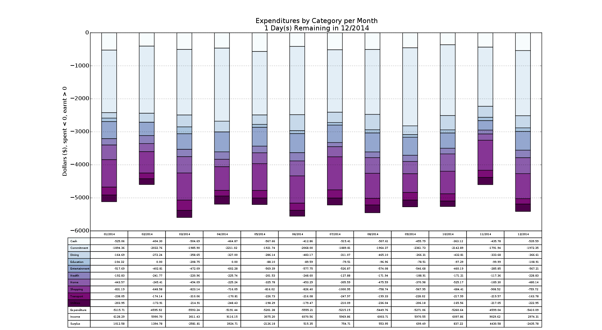
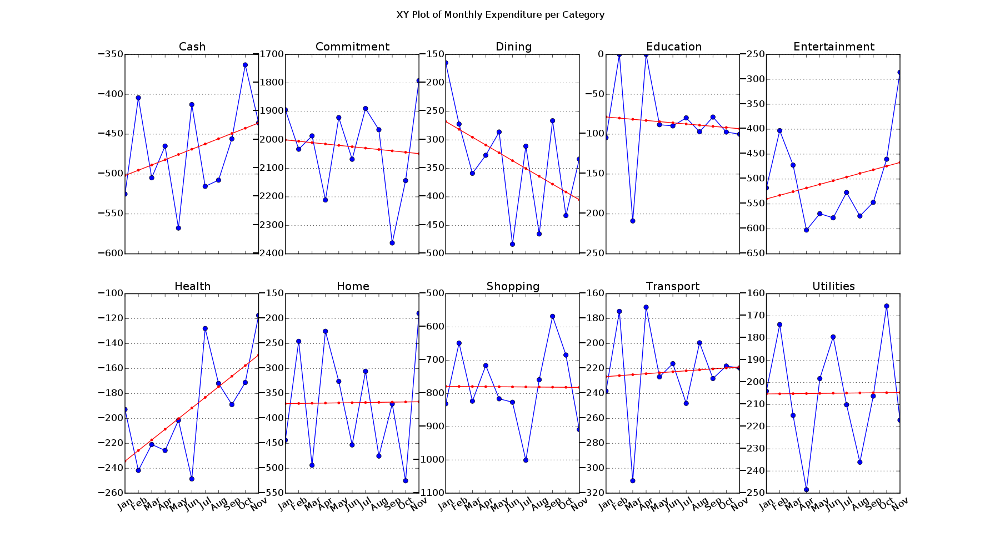

Overview
========

Accumulate and analyse your CSV transaction data to visualise your income and
expenditure.  The categories are based on those used by the Australian Tax
Office on their [MoneySmart website](https://www.moneysmart.gov.au/). These
scripts were hacked together out of laziness when the author got fed up with
manually entering his data into the site.

The scripts are primarily [developed and run on Linux](#everything-else),
though [OSX is also supported](#osx-the-easy-way). Windows is uncharted
territory.

Example Output
==============

[Expenditure by Category per Month](examples/figure_1.md)
---------------------------------------------------------

[Remaining Capital after Expenses](examples/figure_2.md)
--------------------------------------------------------

[Expenses per Month](examples/figure_3.md)
------------------------------------------

[Monthly Expenditure per Category](examples/figure_4.md)
--------------------------------------------------------

[Weekly Expenditure](examples/figure_5.md)
------------------------------------------

[Current Category Expenditure against Derived Budget](examples/figure_6.md)
---------------------------------------------------------------------------

[Monthly Progressive Mean Daily Spend](examples/figure_7.md)
------------------------------------------------------------

[30-day Cashflow Forecast](examples/figure_8.md)
------------------------------------------------

How It Works
============

The Mechanics
-------------

Feeding `fpos` a database and your exported CSV transaction data, it will
automatically:

* Detect the banks from which you've exported the transactions (so it can
  understand the data),
* Deduplicate transactions (so you can export transactions in overlapping
  time periods without problems), and
* Provide you with an easy way to tag each transaction with a spending
  category (guessing the category for you based on previous answers)

The spending categories used are:

* Cash - Withdrawals from ATMs, given its own category as it's hard to track
* Commitment - Rent, mortgages, car repayments, etc
* Dining - Cafes, Restaurants, anything that's not a product of Shopping
* Education - School fees, textbooks
* Entertainment - Anything you shouldn't be doing if tight for money
* Health - Private health, gap payments, pet psychology
* Home - Furniture, repairs, gardening supplies
* Income - Any positive amounts
* Internal - Transfers between multiple accounts
* Shopping - Food, alcohol
* Transport - Car registration, insurance, fuel, bus fares, etc
* Utilities - Electricity, gas, phone, internet, etc

`fpos` can then provide you with graphs like above (once your transactions are
categorised) helping you to understand your spending habits.

Supported Banks
---------------

A CSV transaction export from any of the following banks can be processed by `fpos`

* ANZ
* Commonwealth Bank
* St George
* NAB
* Bankwest
* Woolworths Money (2016 format)

If your bank is not supported please get in touch! Either create an issue on
github or email `andrew at aj dot id dot au`.

Usage
=====

`fpos` has been split into "porcelain" (general use) and "plumbing" (internal,
but sometimes useful) commands, similar to `git` if that helps.

The porcelain commands are:

* `fpos init`: Creates and configures a database
* `fpos update`: Handles the merge and annotation of bank export CSV files into the database
* `fpos show`: Displays collated transactions as graphs and tables

Creating a Database
-------------------

    $ fpos init example ~/fpos-example.csv

This registers the nickname 'mydb' with `fpos` and points it to the CSV file in
which to record tagged transactions. `fpos init` only need be executed once
per database - from there on the nickname can be used with the `update` and
`show` subcommands.

Adding Transactions
-------------------

    $ fpos update example examples/transactions.csv

Note that the provided CSV files can be a mix from any of the banks listed
above. `fpos update` automatically takes care of converting each export to the
internal intermediate representation (unless it doesn't, in which case file an
issue to add support). The `update` process will also take you through
tagging the transactions.

Here's a sample run on the example database:

    $ fpos update example examples/transactions.csv
    Spent $70.14 on 02/01/2014: Tommy Kerry Prakash Louis Werner
    Category [?]: ?

    Cash
    Commitment
    Dining
    Education
    Entertainment
    Health
    Home
    Income
    Internal
    Shopping
    Transport
    Utilities

    Category [?]: Entertainment
    ...

Typing '?' at the prompt will print the list of valid categories, and then
prompt again for category input.

    ...
    Spent $109.42 on 05/01/2014: VISA DEBIT PURCHASE CARD Cathryn Isaac Wesley Hohn Clarissa [72307398]
    Category [?]: sshhoopp
    Couldn't determine category from sshhoopp
    Category [?]: shop
    ...

Unrecognised category inputs cause an error to be printed and `fpos` will
prompt again for a valid category to be provided. Here we also see that the
category matching is case-insensitive and will match on prefixes that are short
enough to be unique (in this case just 's' should be enough as there are no
other categories starting with 's', but 'shop' was used to clarity)

    ...
    Spent $56.10 on 06/01/2014: Tommy Kerry Prakash Louis Werner
    Category [Entertainment]:
    ...

Here in the square brackets we see "Entertainment" - this is the category
`fpos` suggests for the transaction. Here the transaction's description is the
same as the first transaction we tagged, where we said it was "Entertainment".
If it's correct, simply hit Enter/Return to select the suggested category.

This process continues until all new transactions are categorised.

Displaying Graphs
-----------------

    $ fpos show example

Currently this will show graphs for transactions spanning up to 12 months, even
if the data in the database represents a greater time span.

If you're just a user and not a hacker of `fpos`, these three commands are all
you'll need to use regularly.

Plumbing Commands
-----------------

If you're hacking `fpos` the following "plumbing" commands might be useful. At
this point in time the source is the best documentation - this section just
exists to give a brief overview:

* `fpos transform`: Converts each bank's CSV export document into an intermediate
  representation (IR) suitable for further processing
* `fpos combine`: Merges multiple IR documents into one time-ordered document
* `fpos annotate`: tags transactions with spending category information
* `fpos visualise`: Displays collated transactions as graphs and tables
* `fpos window`: Output document transactions between given dates

Installing and Running
======================

OSX The Easy Way
----------------

`fpos` can be installed and managed on OSX without a lot of effort, though
installation does require admin privileges unless you're feeling adventurous.
To install it, open the Terminal app and run (copy/paste) the following two
lines:

    curl -fsSL -o fposx https://raw.githubusercontent.com/amboar/fpos/master/bin/fposx && chmod +x fposx

and

    ./fposx install

Once that's complete an environment for `fpos` can then be launched with:

    ./fposx run

See [Usage](#usage) for the details of how to drive `fpos`.

Finally, `fpos` and its build- and run-time dependencies can be updated at any
point by running:

    ./fposx upgrade

Note that the commands above will install a number of tools onto your system to
bootstrap and run `fpos`. For the record, these tools include the following:

* [homebrew](https://brew.sh/)
* [git](https://git-scm.com)
* [python3](https://www.python.org)
* [virtualenv](https://pypi.python.org/pypi/virtualenv)
* [clang-omp](http://clang.llvm.org/)

All installations are managed with homebrew, and the tools are only installed
or upgraded if you hadn't previously installed them on the system.

Everything Else
---------------

*Build-time Dependencies*

0. Python 3
1. C Compiler (GCC / Clang) with OpenMP support
2. GNU Make
3. BLAS / LAPACK Libraries

On Ubuntu 15.10:

    $ sudo apt-get install python3 gcc make libblas-dev liblapack-dev gfortran

*Run-time Dependencies*

See `requirements.txt`

*Installation*

Despite being a Python-based project, installation of `fpos` is driven by
`make`. `make` is used to manage configuration of `ccan` modules used by
`fpos`, and to then drive `distutils` for the remainder of the installation. On
Linux distros the following steps will install `fpos` and other scripts into
`~/.local/bin`, so make sure this is listed in your `$PATH`.

If the system already provides the dependencies listed in `requirements.txt`
then the following step can be skipped. However if the dependencies are not
installed, then `make` can be invoked to drive `pip` to install the required
modules:

    $ make pip

Once the dependencies are available on the system, install `fpos`:

    $ make install

Further, `fpos` can be installed in a virtualenv. The `Makefile` has several
targets to help generate and install `fpos` with respect to the virtualenv. The
default name for the virtualenv directory is `ve` and it is created in the
current working directory:

    $ make ve
    $ source ve/bin/activate
    $ make pip-ve
    $ make install-ve
    $ deactivate

Generating the virtualenv may take a while as fpos depends on
numpy/scipy/matplotlib which are sizeable dependencies with native extensions.

Once this is complete we're ready to run `fpos`. If using a virtualenv,
remember to activate and deactivate before and after your session:

    $ source ve/bin/activate
    $ fpos --help
    ...
    $ deactivate

See [Usage](#usage) for the details of how to drive `fpos`.

Intermediate Representation
===========================

Out of a want for simplicity (laziness) `fpos` uses a simple text file as a
database for the information it graphs. Power users might be interested in
tracking changes to their transaction database using [git](http://git-scm.com/)
or similar tools.

The intermediate representation and database format is CSV. The columns are:

1. Date, represented as dd/mm/yyyy
2. Amount, negative for expenses, positive for income
3. Description, a human readable message provided by the bank
4. Category, describes the type of transaction

Note that `transform` must output IR with at least the first three columns.
`combine` will use data in the first three columns but will not strip the fourth
if present. `annotate` learns from rows containing the category to guess at the
category for rows lacking it and as such the document output by annotate will
have all four columns. `visualise` requires all four fields to function.

Example IR Document
-------------------

    05/08/2013,981.24,Example description,Income
    06/08/2013,-67.88,Example description,Dining
    08/08/2013,-457.41,Example description,Commitment
    08/08/2013,-46.87,Example description,Commitment
    09/08/2013,-89.73,Example description,Transport
    09/08/2013,-59.75,Example description,Cash
    09/08/2013,-23.86,Example description,Utilities
    09/08/2013,-34.92,Example description,Health

Licenses
========

* `lib/fpos/propernames` is licensed under GPLv2, copied from
  [GNU's miscfiles](https://www.gnu.org/software/miscfiles/) package.
