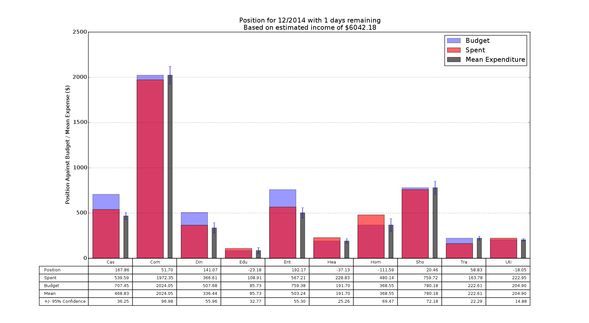

fpos - Financial Position

Overview
========

Accumulate and analyse your CSV transaction data to visualise your income and
expenditure.  The categories are based on those used by the Australian Tax
Office on their [MoneySmart website](https://www.moneysmart.gov.au/). These
scripts were hacked together out of laziness when the author got fed up with
manually entering his data into the site.

Example Output
========

Details
=======

Transactions are put in one of the following categories:

* Cash - Withdrawals from ATMs, given its own category as it's hard to track
* Commitment - Rent, mortgages, car repayments, etc
* Dining - Cafes, Restaurants, anything that's not a product of Shopping
* Education - School fees, textbooks
* Entertainment - Anything you shouldn't be doing if tight for money
* Health - Private health, gap payments, pet psychology
* Home - Furniture, repairs, gardening supplies
* Income - Any positive amounts
* Internal - Transfers between multiple accounts
* Shopping - Food, alcohol
* Transport - Car registration, insurance, fuel, bus fares, etc
* Utilities - Electricity, gas, phone, internet, etc

fpos is intended to track transaction data over long periods of time; that is,
it's expected that users will want to gradually add transactions to a central
database over time. fpos includes the tools for merging and deduplicating
transactions automatically, and learns from your previous interactions with it
to ease the burden of categorising your expenses.

fpos is currently a commandline tool, and so is not for the faint-of-heart. Out
of a want for simplicity (again, read as laziness), fpos uses a simple text
file as a database for the information it graphs. Power users might be
interested in tracking changes to their transaction database using [git](http://git-scm.com/) or
similar tools.

The relevant commands are:

* `fpos transform`: Converts each bank's CSV export document into an intermediate
  representation (IR) suitable for further processing
* `fpos combine`: Merges multiple IR documents into one time-ordered document
* `fpos annotate`: Annotates an IR document with transaction types.
* `fpos visualise`: Displays collated transactions as graphs and tables
* `fpos window`: Output document transactions between given dates

Use Cases
=========

Some minimal help is available using the `--help` option for each subcommand.
Make sure to read this! However, below we will explore the basic patterns and
usecases. For the use cases we'll assume we have at least one NAB account. In
examples with additional accounts other banks may be used to demonstrate other
functionality. In the examples our freshly exported CSV file names will match
the pattern "(nab|stgeorge|...)-export[0-9]\*\\.csv", e.g. export1.csv, export29.csv.

Starting Out: No History and a Single Account
---------------------------------------------

Here's the simple case; it's the first time we've used fpos and we want to look
at data from a single account.

    $ fpos transform nab nab-export.csv transformed.csv
    $ fpos annotate transformed.csv database.csv
      ...
    $ fpos visualise database.csv

Starting Out: No History and Multiple NAB Accounts
--------------------------------------------------

If we have multiple accounts we'd be missing information from the graphs if we
didn't include transaction data from all of them. Here we have three NAB
accounts; in the example presented here it's important that the exports are
from the same bank.

    $ cat nab-export1.csv nab-export2.csv nab-export3.csv | fpos transform nab - transformed.csv
    $ fpos annotate transformed.csv database.csv
      ...
    $ fpos visualise database.csv

Starting Out: No History and Multiple Accounts with Different Banks
-------------------------------------------------------------------

This is similar to no history with a single account; the difference is we will
have multiple calls to the translate subcommand. Here we demonstrate managing a
NAB and a St George account.

    $ fpos transform nab nab-export.csv transformed1.csv
    $ fpos transform stgeorge stgeorge-export.csv transformed2.csv
    $ fpos combine transformed1.csv transformed2.csv > combined.csv
    $ fpos annotate combined.csv database.csv
      ...
    $ fpos visualise database.csv

Creating a Transaction Database
-------------------------------

There's not much to keeping a history of your transactions. The `database.csv`
we created with `fpos annotate` and passed to `fpos visualise` is the beginning
of your history. Updating your transaction database is a matter of calling
`fpos combine` with database.csv as the first argument, where subsequent
arguments are transformed CSV exports from your accounts. These exports should
cover the period from the last update to `database.csv`. `fpos combine`
performs deduplication of transactions, so overlapping exports can be used
without concern.

Updating an Existing Database
-----------------------------

We'll assume a `database.csv` exists as per the "Starting Out:" use cases
above. We've seen how to manage merging multiple exports, from different banks,
and thus will only demonstrate updating an existing `database.csv` with a
single NAB 'update' export, named "nab-update-export.csv".

    $ fpos transform nab nab-update-export.csv transformed.csv
    $ fpos combine database.csv transformed.csv > combined.csv
    $ fpos annotate combined.csv database.csv
      ...
    $ fpos visualise database.csv

Here the annotations from the initial `database.csv` are carried over by `fpos
combine` into `combined.csv`. `fpos annotate` then learns from these existing
annotations to make suggestions for the uncategorised transactions added by
`update-export.csv`. Multiple transformed CSV files can be passed to `fpos
combine` to reduce the calls necessary.

Dependencies
============

Build-time
----------

0. Python 3
1. C Compiler (GCC / Clang)

Run-time
--------

0. Python 3
1. Numpy
2. Scipy
3. Matplotlib

Installation
============

Install python 3 and dependencies, eg with apt-get
	apt-get install python3 libpy-blah blah

Then build and install
python3.4 ./setup.py build
sudo python3.4 ./setup.py install

On OSX manually linking fpos to $PATH is required
sudo ln -s /opt/local/Library/Frameworks/Python.framework/Versions/3.4/bin/fpos /opt/local/bin/fpos

Intermediate Representation
===========================

The intermediate representation and database format is CSV. The columns are:

1. Date, represented as dd/mm/yyyy
2. Amount, negative for expenses, positive for income
3. Description, a human readable message provided by the bank
4. Category, describes the type of transaction

Note that transform must output IR with at least the first three columns.
combine will use data in the first three columns but will not strip the fourth
if present. annotate learns from rows containing the category to guess at the
category for rows lacking it and as such the document output by annotate will
have all four columns. visualise requires all four fields to function.

Example IR Document
-------------------

    05/08/2013,981.24,Example description,Income
    06/08/2013,-67.88,Example description,Dining
    08/08/2013,-457.41,Example description,Commitment
    08/08/2013,-46.87,Example description,Commitment
    09/08/2013,-89.73,Example description,Transport
    09/08/2013,-59.75,Example description,Cash
    09/08/2013,-23.86,Example description,Utilities
    09/08/2013,-34.92,Example description,Health

Licenses
========

* `lib/fpos/propernames` is licensed under GPLv2, copied from
  [GNU's miscfiles](https://www.gnu.org/software/miscfiles/) package.
