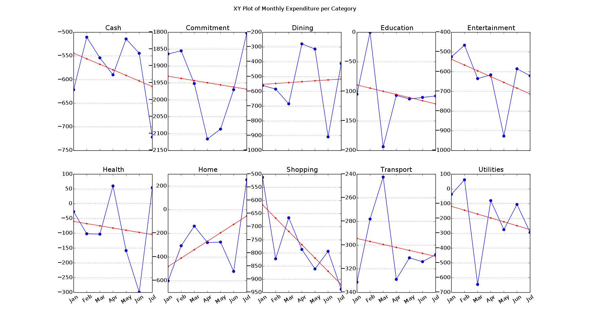

Monthly Expenditure per Category
================================

The X axes are the same across all subplots but be aware that the Y scale will
very likely be different for every subplot. No inference should be
made between subplots without consulting the Y axis values. Note that the Y
axis values are negative, in keeping with the display custom of `fpos`. The
plots only consider completed months as the current month would inaccurately
skew the line of best fit towards zero. The line of best fit should always be
taken with a grain of salt, it's purpose is to provide a rough indicator of
whether your expenses are reducing or increasing in a given category.

This collection of subplots provides the means to compare spending habits in a
given category, something that is difficult to achieve with the stacked-bar
chart in [Expenditure by Category per Month](figure_1.md).

[back to README](../README.md)
