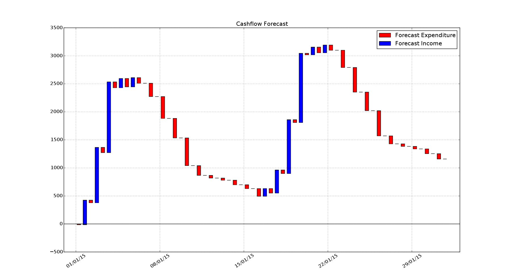

30-day Cashflow Forecast
========================

Using the same spending prediction capability as [Monthly Progressive Mean
Daily Spend](figure_7.md), this graph projects cash-flow over the coming 30
days. The X axis represents days, and the Y axis represents changes in held
cash. Each day is represented by two bars, one red and one blue. The red bars
represent expenses and the blue bars represent income. The top of each red bar
aligns with the top of the blue bar from the previous day. The bottom of each
red bar aligns with the bottom of the blue bar for the current day. In this
way, the bar graph is similar to snakes and ladders - the red bars are snakes
that you slide down, and the blue bars are ladders that you climb up. If the
tip of the right-most blue bar is positive then you are projected to save money
over the following 30 days, likewise if it's negative you are projected lose
money (i.e.  be spending more than you've earned). And you get to see what days
it's projected to all go wrong along the way.

The way the graph is generated is through a probability mass function matrix
with transaction clusters for rows and days for columns, and separate matrices
for expenses and income. Each cell represents the probability that a
transaction with the row's merchant will occur on that day. This probability is
calculated by taking the difference in days between successive transactions
with the merchant, binning each value and finally dividing the bin's count
through by the total number of transactions with the merchant. The mean value
of the merchant's transactions is then distributed over the row's columns,
multiplying by the spend probability. In this way, a single transaction is
actually smeared over multiple days which to a degree represents the haziness
of the future.

The mass function output is cycled as required to stretch the predictions out
to 30 days (there are some further tricks here, but we'll spare the details).

Finally, the graph is generated by summing over the day columns for income and
expenses, and plotting the magnitude of each value.

[back to README](../README.md)
